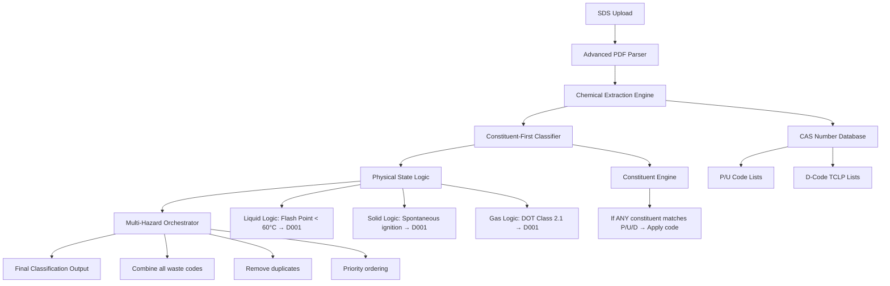

# REVOLUTIONARY CLASSIFIER - Master System Architecture

## 🎯 Mission: Build the First Classifier That Actually Works

**Goal**: Constituent-first classification where ANY chemical on an SDS automatically triggers its associated waste codes.

## System Architecture Flow

## Phase Implementation Plan

### Phase 1: Core Constituent Engine (CURSOR)
- **Target**: Build ConstituentFirstClassifier.js
- **Input**: Chemical composition with CAS numbers
- **Logic**: Direct CAS lookup → immediate code assignment
- **Output**: Array of waste codes with confidence scores

### Phase 2: Advanced PDF Parser (VS CODE COPILOT)  
- **Target**: Build BulletproofSDSExtractor.js
- **Focus**: Chemical name + CAS extraction from Section 3
- **Logic**: Multi-pattern matching, confidence scoring
- **Output**: Clean chemical composition array

### Phase 3: Physical State Logic (CHATGPT)
- **Target**: Build PhysicalStateClassifier.js  
- **Focus**: State-dependent D001/D002 classification
- **Logic**: Different criteria for liquids/solids/gases
- **Output**: Characteristic waste codes (D001-D003)

### Phase 4: Integration Orchestrator (CLAUDE)
- **Target**: Build MasterOrchestrator.js
- **Focus**: Combine all engines, handle conflicts
- **Logic**: Priority system, final validation
- **Output**: Complete classification with reasoning

## Checkpoint System

### ✅ Checkpoint 1: Project Structure
- [x] REVOLUTIONARY-CLASSIFIER folder created
- [x] Development subfolders for each AI
- [x] Regulatory data files copied
- [x] Master flowchart created

### 🔄 Checkpoint 2: Constituent Engine (CURSOR)
- [ ] ConstituentFirstClassifier.js created
- [ ] P/U/D code lookup working
- [ ] Basic test suite passing
- [ ] Integration ready

### ⏳ Checkpoint 3: PDF Parser (COPILOT)
- [ ] BulletproofSDSExtractor.js created
- [ ] Multi-pattern chemical extraction
- [ ] CAS number validation
- [ ] Parser test suite

### ⏳ Checkpoint 4: Physical State Logic (CHATGPT)
- [ ] PhysicalStateClassifier.js created
- [ ] State-dependent D-code logic
- [ ] Flash point / pH classification
- [ ] State logic test suite

### ⏳ Checkpoint 5: Final Integration (CLAUDE)
- [ ] MasterOrchestrator.js created
- [ ] All engines integrated
- [ ] Conflict resolution logic
- [ ] End-to-end testing

## Recovery Protocol

If session interrupted:
1. Check latest checkpoint status in tracking documents
2. Review _COMPLETED_ files in each AI folder
3. Continue from last incomplete phase
4. Sync progress across all AI platforms

## Success Metrics

- **Target Accuracy**: 95%+ on known test cases
- **Speed**: < 2 seconds per SDS analysis
- **Coverage**: All P/U/D codes + characteristic hazards
- **Validation**: Real-world batch testing

**Status**: Ready for Phase 1 launch with CURSOR! 🚀